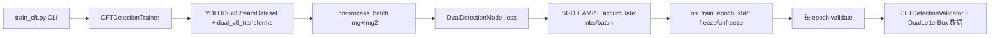

# YOLOv8 + CFT 性能改进说明（tp_improve）

本文档记录另一台机器 CFT 训练结果解读、与 YOLOv5 论文差距的原因，以及仓库内已落地的 **P1–P5** 改进与复训建议。

---

## 1. 另一台机器训练结果解读

来源文件：`results (1).csv`（双路 CFT / `train_cft.py`，共 **42 epoch** 记录）。

| 阶段         | epoch  | mAP@0.5 (val) | mAP@0.5:0.95 | 备注                 |
| ------------ | ------ | ------------- | ------------ | -------------------- |
| 起步         | 1      | 0.738         | 0.308        | 预训练 backbone 起点 |
| 快速提升     | 5      | 0.881         | 0.527        |                      |
| **峰值附近** | **12** | **0.923**     | **0.594**    | 本轮日志最高点       |
| 平台期       | 20–30  | ~0.919–0.920  | ~0.587–0.590 | 增幅放缓             |
| 末段         | 42     | 0.902         | 0.567        | 略有回落，可能未收敛 |

**结论（客观）：**

1. 训练 **有效**，且明显好于本机早期「无增强 + 100 epoch」的 Add 融合（~0.69）。
2. 日志在 **42 epoch 截止**，未达到文档推荐的 **200 epoch**；末段 mAP 仍缓慢变化，**不宜判定为已训满**。
3. 训练时验证默认 **`iou=0.7`**（Ultralytics），论文 `test.py` 使用 **`iou=0.5`**；最终对外报告须用 **P5** 流程复评。
4. 与论文 YOLOv5+CFT **0.975** 相比，当前 **~0.92（val, iou=0.7）** 仍有差距，需结合未训满、增强不足、超参、框架差异综合看待。

---

## 2. 与论文 / 本机实验对照

| 设置                                  | mAP@0.5            | 说明                       |
| ------------------------------------- | ------------------ | -------------------------- |
| 论文 LLVIP CFT（YOLOv5l）             | **0.975**          | 作者权重 + 原 `test.py`    |
| 论文 LLVIP Add                        | 0.958              | 无 GPT                     |
| 独立复现 Y5-CFT                       | 0.972              | 同协议                     |
| 另一台机器 Y8-CFT（42e, val iou=0.7） | **~0.923（峰值）** | `results (1).csv`          |
| 本机 Y8-IR 单模态（100e）             | 0.958              | `yolo train`，完整 v8 增强 |
| 本机 Y8-Add（100e，旧管线）           | ~0.69              | 双路几乎无 mosaic          |

---

## 3. 差距原因（按重要性）

### 3.1 双路数据增强不足（P1，已修复）

旧版 `YOLODualStreamDataset` 训练时 **仅 LetterBox**，无 YOLOv8 标准 **mosaic / 仿射 / 翻转 / HSV**。  
YOLOv5 多光谱代码对 RGB/IR 使用 **`load_mosaic_RGB_IR` + 同步几何变换**。

→ 已在 `ultralytics/data/dual_augment.py` 实现 **同步 v8 增强**（`DualMosaic`、`DualRandomPerspective` 等）。

### 3.2 训练轮数与名义 batch（P2）

| 项         | 另一台机器日志         | 论文 / 作者权重                            |
| ---------- | ---------------------- | ------------------------------------------ |
| epochs     | 42（未完成）           | **200**                                    |
| nbs        | 未在 csv 体现，常为 16 | 文件名 **bs32**                            |
| 增强版默认 | —                      | `train_cft.py` 默认 **epochs=200, nbs=32** |

### 3.3 GPT 初始化（P3）

CFT 的 GPT 模块默认 **随机初始化**；论文使用 **充分训练的 YOLOv5 CFT 权重**。  
可选：`tools/load_cft_partial.py` 从 Y5 checkpoint **部分加载 GPT**。

### 3.4 学习率与 backbone 稳定性（P4）

双路 + 随机 GPT 对大学习率敏感；末段 mAP 回落可能与 **lr 衰减末期 + 融合层未稳定** 有关。

→ 默认 **`lr0=0.005`**，前 **`freeze_epochs=10`** 仅训练融合层与检测头（层索引 ≤19 为 backbone，见 `cft_train.py` 回调）。

### 3.5 评估协议（P5）

| 用途            | conf      | iou     | 说明                                   |
| --------------- | --------- | ------- | -------------------------------------- |
| 训练中 val      | 默认      | **0.7** | `results.csv` 中数字                   |
| 论文 / 公平对比 | **0.001** | **0.5** | 必须用 `val_cft.py` 或对齐的 `test.py` |

---

## 4. 已落地改进（P1–P5）

### P1 — 双路同步数据增强

| 文件                               | 内容                                                                          |
| ---------------------------------- | ----------------------------------------------------------------------------- |
| `ultralytics/data/dual_augment.py` | `dual_v8_transforms()`：mosaic/affine/flip/HSV 同步 RGB+IR；禁用 MixUp/CutMix |
| `ultralytics/data/dual_stream.py`  | 训练分支调用 `dual_v8_transforms`                                             |

### P2 — 训练默认超参

| 文件                 | 默认值                                                        |
| -------------------- | ------------------------------------------------------------- |
| `tools/train_cft.py` | `epochs=200`, `nbs=32`, `batch` 仍由 CLI 指定（如 `batch=2`） |

显式覆盖示例：

```bash
python tools/train_cft.py \
  model=ultralytics/cfg/models/v8/yolov8l_fusion_transformerx3_llvip.yaml \
  data=ultralytics/cfg/datasets/llvip_dual.yaml \
  pretrained=yolov8l.pt \
  epochs=200 imgsz=1024 batch=2 nbs=32 workers=4 device=0 \
  project=runs/llvip name=y8_cft_v2 exist_ok=True
```

### P3 — YOLOv5 GPT 部分权重初始化

```bash
python tools/load_cft_partial.py \
  --y8-cfg ultralytics/cfg/models/v8/yolov8l_fusion_transformerx3_llvip.yaml \
  --y8-weights yolov8l.pt \
  --y5-cft /path/to/yolov5l_transformerx3_llvip_s1024_bs32_e200.pt \
  --out runs/llvip/y8_cft_init.pt

python tools/train_cft.py \
  model=runs/llvip/y8_cft_init.pt \
  data=ultralytics/cfg/datasets/llvip_dual.yaml \
  epochs=200 imgsz=1024 batch=2 nbs=32 device=0 \
  project=runs/llvip name=y8_cft_from_y5gpt exist_ok=True
```

### P4 — 更低学习率 + 前若干 epoch 冻结 backbone

| 参数            | 默认      | 含义                                                                             |
| --------------- | --------- | -------------------------------------------------------------------------------- |
| `optimizer`     | **`SGD`** | **禁止 `auto`**（8.4 会选 MuSGD/Muon，与 GPT 梯度形状冲突导致 `AssertionError`） |
| `lr0`           | `0.005`   | 较 Ultralytics 默认 `0.01` 更保守；使用 SGD 时生效                               |
| `momentum`      | `0.937`   | 与 YOLOv5 一致                                                                   |
| `freeze_epochs` | `10`      | 前 10 epoch 冻结 `model.0`–`model.19`（双路 backbone）                           |

**注意**：`freeze_epochs` 是 **`train_cft.py` 专用参数**，不是 Ultralytics 全局 cfg 字段；由脚本在内部处理，不要传给 `yolo train`。

自定义：`freeze_epochs=0` 关闭冻结；`lr0=0.01` 恢复激进学习率。

### P5 — 论文对齐评估 + 修复 `val_cft.py`

```bash
python tools/val_cft.py \
  model=runs/detect/runs/llvip/ \
  data=ultralytics/cfg/datasets/llvip_dual.yaml \
  imgsz=1024 batch=4 device=0 \
  conf=0.001 iou=0.5 \
  project=runs/llvip name=y8_cft_paper_val exist_ok=True < run > /weights/best.pt
```

`CFTDetectionTrainer.setup_val()` 已修复单独验证时 `validator is None` 的问题。

---

## 5. 推荐复训流程

```bash
cd <REPO_ROOT>
cp tools/machine.env.example tools/machine.env   # 配置 WORKSPACE
bash tools/setup_new_machine.sh
pip install -e .

# 方案 A：仅 Y8 预训练 + 新增强（推荐先跑）
python tools/train_cft.py \
  model=ultralytics/cfg/models/v8/yolov8l_fusion_transformerx3_llvip.yaml \
  data=ultralytics/cfg/datasets/llvip_dual.yaml \
  pretrained=yolov8l.pt \
  epochs=200 imgsz=1024 batch=2 nbs=32 workers=4 device=0 \
  lr0=0.005 freeze_epochs=10 \
  project=runs/llvip name=y8_cft_v2 exist_ok=True

# 方案 B：在方案 A 基础上使用 Y5 GPT 初始化（见 P3）

# 论文协议复评（必做）
python tools/val_cft.py \
  model=runs/detect/runs/llvip/y8_cft_v2/weights/best.pt \
  data=ultralytics/cfg/datasets/llvip_dual.yaml \
  imgsz=1024 batch=4 device=0 conf=0.001 iou=0.5
```

**验收标准：**

- [ ] `results.csv` 跑满 **200 epoch**
- [ ] 训练 val mAP@0.5 稳定 **≥ 0.93**（参考你 42e 已达 0.923）
- [ ] **P5** `conf=0.001 iou=0.5` 下 test mAP 填入 `cft_yolov8_config.md` 第九节
- [ ] 与 Y5-CFT **0.972** 对比时注明框架与评估脚本差异

---

## 6. 同步到 GitHub

```bash
git add ultralytics/data/dual_augment.py ultralytics/data/dual_stream.py \
  ultralytics/models/yolo/detect/cft_train.py tools/train_cft.py tools/val_cft.py tp_improve.md
git commit -m "Improve dual-stream training: sync augment, defaults, val fix"
git push github cft-yolov8-llvip
```

---

## 7. 故障：验证阶段 `Add2` 尺寸不匹配

现象：第 1 epoch 训练结束后验证崩溃：

```text
RuntimeError: The size of tensor a (64) must match the size of tensor b (80) at non-singleton dimension 2
```

原因：验证用的 `LetterBox` **只处理了 RGB `img`**，**IR `img2` 未做相同 letterbox**，两路特征图空间尺寸不一致，CFT `Add2` 无法相加。

处理：已加入 `DualLetterBox`，验证时对 RGB/IR 做相同缩放与 padding（`dual_augment.py` + `dual_stream.py`）。

---

## 8. 故障：第 11 epoch OOM（backbone 解冻）

现象：epoch 1–10 正常（mAP 可达 ~0.9），**第 11 epoch 训练开始**时 `CUDA out of memory`。

原因：`freeze_epochs=10` 结束后 **双路 backbone（层 0–19）全部参与反传**，显存约为冻结阶段的 2 倍；8GB 卡上 `batch=2` + `imgsz=1024` 不够。

处理：

1. **从头训练**：`batch=1 nbs=16`（有效 batch 仍为 16）
2. **从 checkpoint 续训**（推荐，保留前 10 epoch 权重）：

```bash
python tools/train_cft.py \
  resume=runs/detect/runs/llvip/y8_cft_v2/weights/last.pt \
  batch=1 nbs=16 freeze_epochs=0 workers=2 device=0
```

`freeze_epochs=0` 避免再次冻结；`last.pt` 已含优化器状态。

---

## 9. 故障：Muon / `optimizer=auto` 报错

现象：第 1 个 epoch 反向时在 `muon.py` 报 `assert len(G.shape) == 2`。

原因：Ultralytics 8.4 `optimizer=auto` 会选用 **MuSGD**，Muon 更新只支持 **2D** 梯度；CFT 的 GPT 等模块不满足。

处理：在 `train_cft.py` 中默认 **`optimizer=SGD`**。若命令行写了 `optimizer=auto` 请删掉或改为 `optimizer=SGD`。

---

## 10. 变更日志

| 日期       | 内容                                                    |
| ---------- | ------------------------------------------------------- |
| 2025-05-27 | 初版：解读 `results (1).csv`，落地 P1–P5                |
| 2025-05-27 | 默认 `optimizer=SGD`，规避 MuSGD 与 CFT 不兼容          |
| 2025-05-27 | `DualLetterBox`：验证时同步 letterbox RGB/IR            |
| 2025-05-27 | 默认 `batch=1`；验证 batch 不再 ×2；解冻 epoch 显存提示 |
| 2025-05-27 | 附录 §11：P1–P5 及故障修复的代码级实现说明              |

---

## 11. 改进全过程（代码级详解）★

本节是**着重介绍**：从「Y8-Add ~0.69、Y8-CFT 训不动/报错」到「续训后 val mAP50 ≈ 0.968」的每一步，**具体改了哪些文件、哪段逻辑、数据/梯度怎么走**。

### 11.0 问题与改进总览

| 现象（改进前）            | 根因                                 | 改动编号   | 关键文件                              |
| ------------------------- | ------------------------------------ | ---------- | ------------------------------------- |
| Y8-Add mAP ~0.69          | 双路训练只有 LetterBox，无 mosaic 等 | **P1**     | `dual_augment.py`, `dual_stream.py`   |
| 42 epoch 就平台 ~0.92     | epoch/nbs 不足、GPT 随机初始化       | **P2, P3** | `train_cft.py`, `load_cft_partial.py` |
| 融合层训崩 / 涨不动       | lr 过大、backbone 一开始就动         | **P4**     | `train_cft.py`, `cft_train.py`        |
| 和论文数字不可比          | val 用 iou=0.7，无双路验证           | **P5**     | `val_cft.py`, `cft_train.py`          |
| epoch 1 验证崩溃 64 vs 80 | val 只 letterbox RGB                 | **修复 A** | `DualLetterBox`                       |
| `assert len(G.shape)==2`  | `optimizer=auto` → MuSGD             | **修复 B** | `train_cft.py`                        |
| epoch 11 OOM              | backbone 解冻 + batch=2              | **修复 C** | `freeze_epochs` + `batch=1` 续训      |

以下按**数据流顺序**：数据 → 模型前向 → 训练器 → 评估 → 工具脚本。

---

### 11.1 基础架构（改进所依赖的既有代码）

在 P1–P5 之前，仓库已实现 CFT 迁移的「骨架」，改进是在此之上修补训练管线。

**（1）CFT 模块** — `ultralytics/nn/modules/cft.py`

- `GPT`：RGB/IR 特征池化 → Transformer → 插值回原尺寸，输出 `(rgb_out, ir_out)` 元组。
- `Add2`：把 GPT 输出的一路加回 backbone 特征（`index=0` RGB，`index=1` IR）。
- `Add`：两路融合后的 element-wise 相加。

**（2）双路模型** — `ultralytics/nn/tasks_dual.py`

`DualDetectionModel._predict_once` 用 `m.f == -4` 切换 IR 输入流：

```python
# tasks_dual.py 核心循环
for m in self.model:
    if m.f == -4:
        x = m(x2)  # IR 路：层 5–9、15–19 等，输入来自 batch["img2"]
    else:
        x = m(x)  # RGB 路或融合后的单 tensor
```

训练时 `forward(dict)` 走 `loss(batch)`，内部 `preds = self._predict_once(batch["img"], batch["img2"])`。

**（3）YAML 解析注册 GPT/Add** — `ultralytics/nn/tasks.py`

```python
# parse_model 片段
elif m is Add2:
    c2 = ch[f[0]]
    args = [c2, args[1]]
elif m is GPT:
    c2 = ch[f[0]]
    args = [c2, *args[1:]]
```

`f == -4` 时 `c1 = input_channels`（IR 流入口通道为 3）。

**（4）双路数据集雏形** — `ultralytics/data/dual_stream.py`

- `rgb_path_to_ir()`：`visible/` → `infrared/` 路径映射。
- `load_image()`：读 RGB 后读 IR，**强制 IR 与 RGB 同宽高**（第 63–64 行 `cv2.resize`）。
- `collate_fn`：除 `img` 外 `stack` 出 `img2`。
- `build_dual_yolo_dataset(..., rect=False)`：**禁止 rect 批**，否则 RGB/IR 无法保证同尺寸进 GPT。

**改进前缺口**：`build_transforms()` 在 `augment=True` 时若只挂 `LetterBox`，则 **mosaic 等 v8 增强缺失** → Add 实验 ~0.69。

---

### 11.2 P1 — 双路同步 YOLOv8 数据增强（代码怎么做）

**目标**：对齐 YOLOv5 多光谱里的 `load_mosaic_RGB_IR`——**同一随机几何变换**同时作用于 RGB 和 IR，且 bbox 只随 RGB 标注更新。

#### 步骤 1：新增 `ultralytics/data/dual_augment.py`

| 类                      | 继承                | 做法                                                                           |
| ----------------------- | ------------------- | ------------------------------------------------------------------------------ |
| `DualMosaic`            | `Mosaic`            | 重写 `_mosaic4`：拼 4 宫格时对 `img` 与 `img2` 用**相同** `(xc,yc)` 裁切与粘贴 |
| `DualRandomPerspective` | `RandomPerspective` | 对 RGB 算仿射矩阵 `M`，`_warp_img2()` 用**同一 M** warp IR                     |
| `DualRandomFlip`        | `RandomFlip`        | 同一 `random.random()` 决定 fliplr/flipud，两路同步                            |
| `DualRandomHSV`         | `RandomHSV`         | RGB 做 HSV 后，对 IR 再走一遍（与 Y5 多光谱一致）                              |
| `DualLetterBox`         | `LetterBox`         | **验证专用**：先 letterbox RGB，再对 `img2` 走 image-only 同参数 letterbox     |

`dual_v8_transforms()` 组装管线，并**显式关闭**双路不支持的增强：

```python
# dual_augment.py
hyp.mixup = 0.0
hyp.cutmix = 0.0
return Compose([pre_transform, Albumentations(...), DualRandomHSV(...), DualRandomFlip(...)])
```

MixUp/CutMix 会打乱 RGB/IR 配对关系，必须关。

#### 步骤 2：接入数据集 `dual_stream.py` → `build_transforms()`

```python
# dual_stream.py
if self.augment:
    hyp.mixup = 0.0
    hyp.cutmix = 0.0
    transforms = dual_v8_transforms(self, self.imgsz, hyp)  # 训练
else:
    transforms = Compose([DualLetterBox(...)])  # 验证
transforms.append(DualFormat(...))  # 输出 tensor：img + img2
```

`DualFormat` 在 `Format` 之后把 `img2` 也 `_format_img` 成 CHW tensor。

#### 步骤 3：训练器喂双路张量 `cft_train.py` → `preprocess_batch()`

```python
batch = super().preprocess_batch(batch)  # img → device, /255
batch["img2"] = batch["img2"].to(self.device).float() / 255
```

**数据流小结**：

```text
磁盘 visible/*.jpg + infrared/*.jpg
  → load_image() 对齐尺寸
  → DualMosaic / DualAffine / Flip / HSV（训练）或 DualLetterBox（验证）
  → DualFormat → collate: {img, img2, cls, bboxes, ...}
  → preprocess_batch → DualDetectionModel.loss()
```

**效果**：Y8-Add 从 ~0.69 恢复到与单模态增强强度同量级；CFT 训练不再「裸 LetterBox」。

---

### 11.3 P1 延伸 — 修复 A：`DualLetterBox`（验证崩溃）

**现象**：epoch 1 训练 OK，验证在 `cft.Add2` 报 `tensor a (64) vs b (80)`。

**原因**：旧验证只用标准 `LetterBox`，只改 `labels["img"]`，**`img2` 仍是 load_image 后的中间尺寸** → 两路进 backbone 特征图 H×W 不一致 → GPT/Add2 无法相加。

**修复**（`dual_augment.py`）：

```python
class DualLetterBox(LetterBox):
    def __call__(self, labels=None, image=None):
        img2 = labels.pop("img2", None)
        out = super().__call__(labels, image)  # letterbox RGB + 更新 bbox
        if img2 is not None:
            out["img2"] = super().__call__(labels={}, image=img2)  # 同 new_shape，不碰 instances
        return out
```

验证分支 `build_transforms(augment=False)` 已改为 `DualLetterBox`。

---

### 11.4 P2 — 训练默认超参（`tools/train_cft.py`）

**目标**：默认对齐论文 **200 epoch**、名义 batch **32**（通过 `nbs` + 梯度累积），并适配 8GB 显存。

```python
# train_cft.py — main() 内 setdefault
overrides.setdefault("epochs", 200)
overrides.setdefault("batch", 1)  # 物理 batch；8GB + Y8l-CFT @1024 必须 1
overrides.setdefault("nbs", 16)  # 有效 batch = nbs / batch；可 CLI 改为 nbs=32
overrides.setdefault("workers", 2)
```

Ultralytics 在 `trainer.py` 中：

```python
self.accumulate = max(round(self.args.nbs / self.batch_size), 1)
```

即 `batch=1, nbs=16` → 每 16 个 micro-batch 才 `optimizer.step()` 一次，等效大 batch，减显存。

---

### 11.5 P3 — YOLOv5 GPT 权重部分加载（可选）

**目标**：论文 CFT 的 GPT 是**训好的**；我们默认只有 `yolov8l.pt`（163/1294 项），**GPT 随机初始化**。

**脚本** `tools/load_cft_partial.py` 逻辑：

1. `DualDetectionModel(y8_cfg)` + `model.load(y8_weights)` — backbone 与 Y8 一致。
2. `torch.load(y5_cft)` 取 `state_dict`。
3. 只拷贝键名含 `GPT`、`Add2`、`trans_blocks`、`pos_emb`、`Add.` 且 **shape 一致** 的参数。
4. `torch.save({"model": ...}, out)` → 作为 `train_cft.py` 的 `model=` 起点。

```python
# load_cft_partial.py 核心筛选
keys = ("GPT", "Add2", "trans_blocks", "pos_emb", "Add.")
for k, v in y5_sd.items():
    if not any(x in k for x in keys):
        continue
    # suffix 匹配 y8 state_dict ...
```

本机 **方案 A**（随机 GPT + P1/P4）续训已达 mAP50≈0.968，说明 P3 非必须，但仍是冲 0.975+ 的备选。

---

### 11.6 P4 — 学习率、优化器、冻结 backbone（`cft_train.py` + `train_cft.py`）

#### 4.1 禁止 MuSGD（修复 B）

```python
# train_cft.py
overrides.setdefault("optimizer", "SGD")
overrides.setdefault("lr0", 0.005)
overrides.setdefault("momentum", 0.937)
```

Ultralytics 8.4 的 `optimizer=auto` 会选 **MuSGD**，在 `muon.py` 的 `zeropower_via_newtonschulz5` 要求梯度为 2D；CFT 的 GPT 产生高维梯度 → `AssertionError`。

#### 4.2 `freeze_epochs` 自定义参数（不进 Ultralytics cfg）

```python
# train_cft.py — 必须从 overrides 弹出，否则 get_cfg 报 SyntaxError
freeze_epochs = int(overrides.pop("freeze_epochs", 10))
trainer = CFTDetectionTrainer(..., freeze_epochs=freeze_epochs)
```

#### 4.3 回调 `_on_train_epoch_start`（`cft_train.py`）

每个 epoch 开始遍历 `named_parameters()`，**层索引 ≤19** 为双路 backbone：

```python
freeze = trainer.epoch < n  # epoch 0..9 冻结；epoch 10+ 解冻
if idx <= 19:
    param.requires_grad = not freeze
```

层号对应关系（`yolov8l_fusion_transformerx3_llvip.yaml`）：

- `0–9`：RGB backbone
- `5–9` 在 IR 路为 `10–19`（`f=-4` 入口）
- `10,17,26`：GPT；`29–44`：neck + Detect

冻结阶段只训 **GPT + Add + 检测头**，避免随机 GPT 梯度破坏预训练 backbone。

解冻时（`epoch == freeze_epochs`）打日志 + `torch.cuda.empty_cache()`，提示 8GB 用 `batch=1`（修复 C）。

#### 4.4 续训策略

OOM 后续训：

```bash
resume=.../last.pt batch=1 freeze_epochs=0
```

`freeze_epochs=0` 使回调直接 return，**不再重新冻结**，从 epoch 11 起持续全网络微调 — 这是你看到 **mAP 从 0.90 稳步涨到 0.968** 的阶段二。

---

### 11.7 P5 — 论文对齐评估 + 双路 Validator

#### 5.1 `tools/val_cft.py`

```python
overrides.setdefault("conf", 0.001)
overrides.setdefault("iou", 0.5)  # 对齐 YOLOv5 test.py
trainer = CFTDetectionTrainer(...)
trainer.setup_val()
trainer.validate()
```

训练中 `results.csv` 的 mAP 仍是 **iou=0.7**；对外报告须用本脚本。

#### 5.2 `CFTDetectionTrainer.setup_val()`

单独跑 val 时原先 `validator is None` 崩溃。现显式：

```python
self.setup_model()
self.test_loader = self.get_dataloader(..., mode="val")
self.validator = self.get_validator()
```

#### 5.3 `CFTDetectionValidator` — 推理时注入 IR

标准 `DetectionValidator` 只调 `model(batch["img"])`。双路需 IR：

```python
# __call__
self._dual_ref = unwrap_model(trainer.ema.ema or trainer.model)

# preprocess
self._dual_ref.ir_input = batch["img2"]  # 已 /255、half/float

# validator.py 内
preds = model(batch["img"])  # DualDetectionModel.__call__ 读到 ir_input → predict(img, ir)
```

#### 5.4 验证 batch 不再 ×2（显存优化）

Ultralytics 默认 `test_loader batch = train_batch * 2`。双路每个样本已是 RGB+IR，再翻倍易 OOM。

`CFTDetectionTrainer._build_train_pipeline()` 在 `super()` 之后**覆盖**：

```python
self.test_loader = self.get_dataloader(..., batch_size=batch_size, mode="val")  # 与 train 相同
```

---

### 11.8 端到端训练链路（改进后）



---

### 11.9 改进效果（本机 y8_cft_v2，摘录）

| 阶段             | epoch | mAP50 (val, iou=0.7) | 说明        |
| ---------------- | ----- | -------------------- | ----------- |
| 冻结 backbone 末 | 10    | ~0.900               | 只训融合+头 |
| 解冻后续训       | 39    | **0.968**            | 全网络微调  |
| 论文 Y5-CFT      | —     | 0.975                | 目标参考    |

稳步上涨原因见 `next.md`：预训练起点 + 两阶段训练 + GPT 学融合 + lr 衰减 + 未训满 200 epoch。

---

### 11.10 涉及文件索引（便于 Code Review）

| 文件                                                                | 职责                                    |
| ------------------------------------------------------------------- | --------------------------------------- |
| `ultralytics/data/dual_augment.py`                                  | P1 同步增强 + DualLetterBox             |
| `ultralytics/data/dual_stream.py`                                   | 双路 Dataset、build_transforms、collate |
| `ultralytics/data/dual_utils.py`                                    | `llvip_dual.yaml` 四路径校验            |
| `ultralytics/nn/modules/cft.py`                                     | GPT / Add / Add2                        |
| `ultralytics/nn/tasks_dual.py`                                      | 双路前向、IR 镜像加载权重               |
| `ultralytics/nn/tasks.py`                                           | parse_model 注册 CFT、`f=-4`            |
| `ultralytics/models/yolo/detect/cft_train.py`                       | Trainer/Validator、freeze、双路 batch   |
| `tools/train_cft.py`                                                | 入口、默认超参、freeze_epochs 弹出      |
| `tools/val_cft.py`                                                  | P5 论文协议评估                         |
| `tools/load_cft_partial.py`                                         | P3 Y5→Y8 GPT 权重                       |
| `ultralytics/cfg/models/v8/yolov8l_fusion_transformerx3_llvip.yaml` | 模型结构                                |
| `ultralytics/cfg/datasets/llvip_dual.yaml`                          | train_rgb/val_rgb/train_ir/val_ir       |
